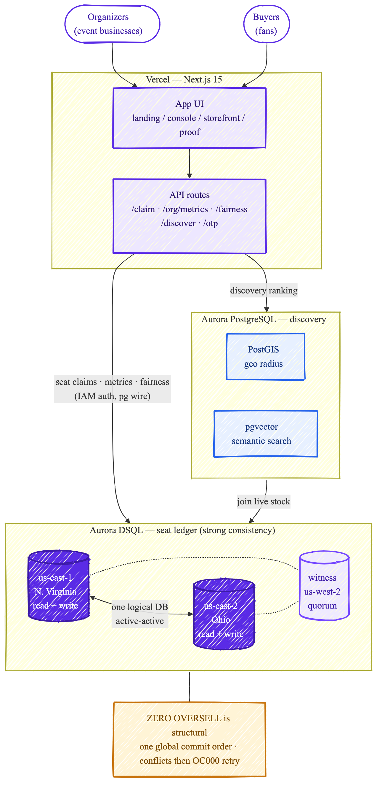

# OpenSlot — Architecture

**Zero-oversell on-sale infrastructure for event businesses.**

## How it fits together

- **Users** — *Organizers* (the paying customers) run on-sales from the console; *Buyers* (fans) get tickets from the storefront.
- **Vercel · Next.js 15** — the app UI (landing / console / storefront / proof) and the API routes (`/claim`, `/org/metrics`, `/fairness`, `/discover`, `/otp`).
- **Aurora DSQL — seat ledger (strong consistency).** Two regional endpoints (`us-east-1` + `us-east-2`) both take reads **and** writes as one logical database, active-active; `us-west-2` is a witness (quorum, no endpoint). A single global commit order is what makes **zero oversell structural** — conflicts surface as `OC000` and retry, never a double-sell. The fairness chain is projected from this ledger.
- **Aurora PostgreSQL — discovery.** PostGIS (geo radius) + pgvector (semantic search) — the extensions DSQL cannot host, which is why a second database is required. Discovery ranks events here, then joins live stock from the DSQL ledger.

## Why dual-DB

Strongly-consistent active-active writes (DSQL) and geo/vector search (PostGIS + pgvector) cannot coexist in one engine today — so OpenSlot uses each for what only it can do: DSQL owns the money-critical seat ledger; Aurora PostgreSQL owns discovery.

> Source: [`openslot-architecture.mmd`](./openslot-architecture.mmd) (Mermaid `look: handDrawn`). Re-render: `npx -y @mermaid-js/mermaid-cli -i openslot-architecture.mmd -o openslot-architecture.png -b white -s 2`.
