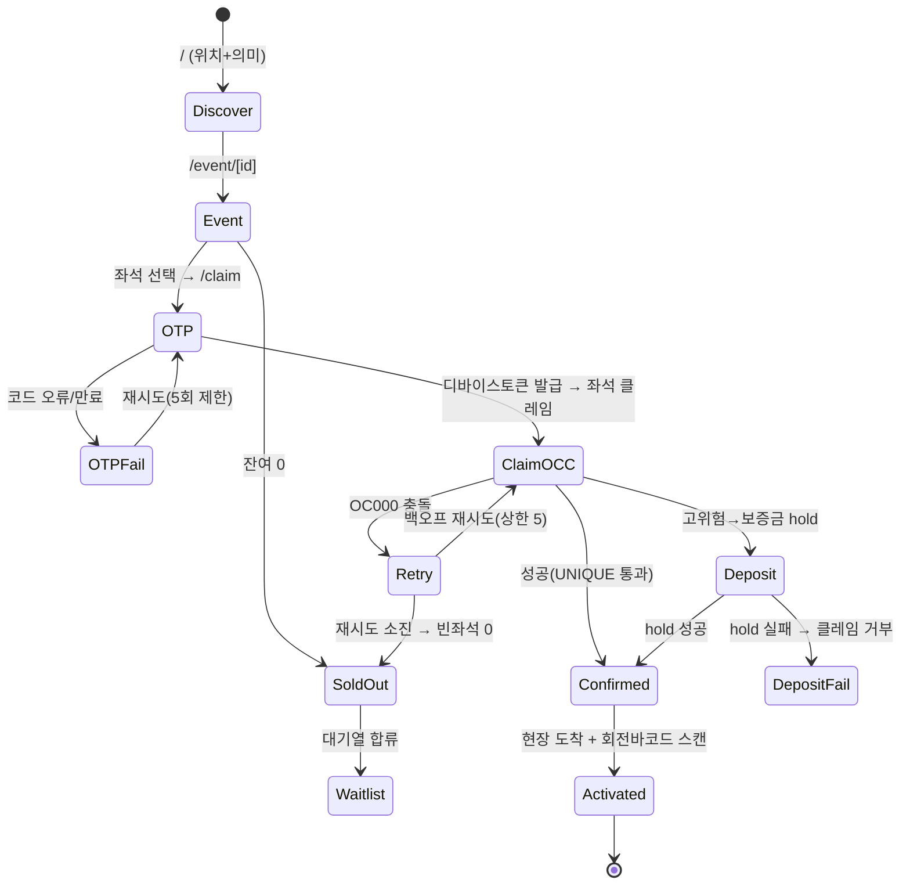
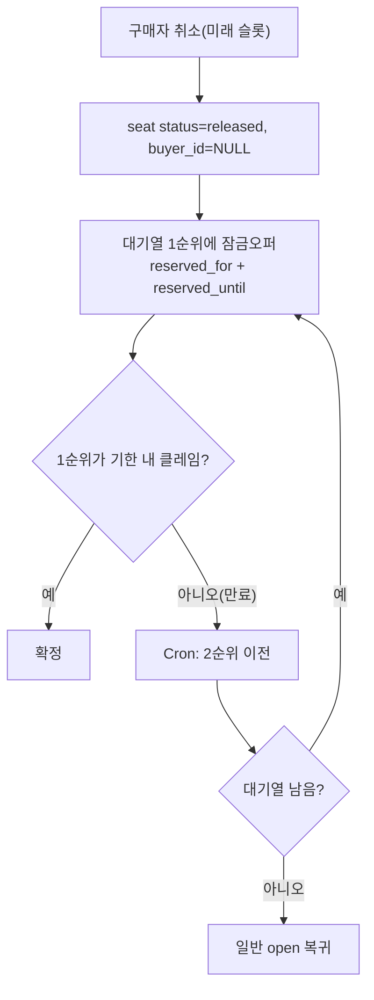

# PRD — OpenSlot · v3.0 (repositioned: global high-demand drops/ticketing)

> **H0 Hackathon (Vercel v0 + AWS Databases)** · 제출 마감 2026-06-29 17:00 PT
> **DB**: Amazon **Aurora DSQL**(글로벌 좌석/재고 원장 — 멀티리전 active-active 강일관) + Amazon **Aurora PostgreSQL**(PostGIS 발견 + pgvector) — 듀얼, 사유 §5.
> **한 줄**: "전 세계가 동시에 같은 한정 좌석/상품(콘서트·스포츠·한정 드롭)을 사는데, **초과/더블판매 0**(DSQL 전역 강일관)으로 공정하게 받고, **신원·기기 바인딩으로 되팔이 마찰을 대폭 올리며**(완전 차단은 아님), 손님은 **내 주변 드롭을 발견**(PostGIS)하고 **현장 도착 시 티켓이 활성화**(지오펜스 + 회전바코드 게이트스캔)되는 플랫폼."

## 변경 이력 (v2.4 → v3.0)
| 변경 | 사유 |
|---|---|
| **포지셔닝 전환**: "일반 고수요 한정슬롯 예약"(식당·클래스 포함) → **"글로벌 고수요 한정 드롭/티켓팅"으로 좁힘** | 일반 예약은 **로컬·저동시성**이라 DSQL 멀티리전 need가 가짜. "전 세계 동시 경쟁"으로 좁혀야 DSQL이 **안 억지로** 산다. |
| 일반 업체 마켓플레이스 제거. **올리는 쪽 = 드롭/온세일 주최자**(아티스트·브랜드·프로모터·티켓 셀러)로 고정 | "아무 업체나 올리는 예약 마켓"으로 넓히면 DSQL 명분 자폭(로컬). |
| PostGIS 역할 = **발견("내 주변 드롭/공연")** 으로 한정. 좌석맵에서 PostGIS 사용 안 함. | 좌석 쿼리는 관계형으로 충분 → PostGIS를 좌석맵에 걸면 "억지로 끼움"으로 보임. |
| 좌석 선택 = **관계형**(section/row/seat + (x,y) 렌더용 좌표) | 위와 동일. |
| 지오펜스(현장 활성화)를 **반되팔이 보조 레이어**로 명시. GPS 스푸핑 한계 명문화. | robust한 현장증명은 회전바코드+게이트스캔(=PostGIS 무관). 지오펜스는 한 겹. |
| DSQL 충돌 에러코드 **`OC000`**(이전 `40001` 오기 정정) | AWS 공식 문서 확인. |
| 트랙 후보를 **Million-Scale Global**로 (엔터테인먼트·글로벌·수백만) 격상 검토 | 글로벌 티켓팅/드롭 = 엔터+글로벌+멀티리전 아키텍처 = 트랙 정의에 정확히 부합. |

---

## 0. 포지셔닝 — DSQL이 안 억지인 유일한 지점

### 0.1 왜 "글로벌 고수요 드롭/티켓팅"인가 (DSQL 정당성의 핵심)
DSQL의 단독 무기 = **멀티리전 active-active 강일관 쓰기**. 이게 *진짜로* 필요한 조건 = **같은 한정 자원을 여러 리전 사람이 동시에 경쟁.** 일반 예약(식당·클래스)은 로컬이라 이 조건이 없다 → DSQL이 forced. 그래서 **전 세계 동시 경쟁이 일상인 영역으로 좁힌다:**
- **티켓팅**: Taylor Swift Eras(2022 Ticketmaster 35억 요청 붕괴), BTS·K-pop 월드투어(전 세계 팬 동시), 월드컵·올림픽.
- **한정 드롭**: Nike SNKRS·Supreme·Yeezy, Pop Mart 라부부(2025 글로벌 광풍), 포켓몬 TCG 재입고, PS5 출시.
- 공통: **전 세계가 같은 초에, 한정 수량, 봇·되팔이 지옥, 2026 반스캘핑 입법**(필라델피아·캘리포니아 AB1640 등).

### 0.2 정직 펜스 (과장 시 감점 방어)
- **DSQL은 "더블판매 0"(일관성)만 푼다. "되팔이/봇"은 못 푼다** — 그건 신원바인딩·봇탐지·현장게이트 문제. **DSQL은 필요조건이지 충분조건 아님.** 반스캘핑은 별도 레이어로 명시.
- **"되팔이 불가"는 과장 — 쓰지 않는다.** 디바이스/계정 바인딩은 **폰·로그인기기·SIM 양도로 뚫림**(실제 바운드티켓 암시장 방식). 정확한 표현 = **"되팔이 마찰 대폭 상승, 봇 대량선점 비경제화"**지 "불가"가 아님. robust 레이어 = **회전바코드(TOTP) + 게이트 스캔**(스크린샷 만료·서버검증·리플레이 방어). 지오펜스·디바이스바인딩은 비용을 올리는 보조 겹.
- **PostGIS 발견("주변 드롭")은 2026 커머디티** — Originality로 주장 안 함. "왜 Postgres"의 기술근거(DSQL은 PostGIS/pgvector 미지원)로만 카운트.
- **현장 지오펜스는 GPS 스푸핑 가능** → robust한 건 회전바코드+게이트스캔(PostGIS 무관). 지오펜스는 "한 겹 보조"로만.
- **레드오션**: Ticketmaster·Eventbrite·DICE·SNKRS·Shopify. 사업으로 뚫는 건 별개 — **해커톤 = "DSQL이 그 난제를 우아하게 푼다"의 데모.**
- **Originality 무게중심** = ① 멀티리전 active-active 공정배분(남들 안 보여주는 그림) ② 신원묶임·현장활성화 anti-scalp(2026 입법 정렬) ③ 한 강일관 원장 위에서 동시 성립.

---

## 1. Overview
### 1.1 Problem
- **주최자(셀러)**: 온세일/드롭 순간 트래픽 폭주 → 사이트 붕괴·초과판매·더블판매. 봇·되팔이가 재고 선점 → 진짜 팬 손해, 암시장(Appointment Trader·되팔이 $350~수천).
- **구매자(전 세계)**: 동시 경쟁에서 공정하게 못 삼. 어디서 어떤 드롭이 열리는지 발견 어려움. 산 티켓도 되팔이로 가격 왜곡.
### 1.2 Goals
- **G1** 글로벌 온세일/드롭에서 **초과/더블판매 0** (멀티리전·크로스리전 동시쓰기에도).
- **G2** **공정 배분 + 되팔이 마찰↑**: 신원·기기 바인딩 + 취소분 1순위 잠금 재방출 + BotID로 **봇 대량선점 비경제화**(완전 차단 주장 안 함).
- **G3** **발견**: 내 주변/관심 드롭을 위치·의미로(PostGIS+pgvector).
- **G4** **현장 활성화 티켓**: 신원·기기 바인딩 + 회전바코드(TOTP) + 도착 시 활성화(되팔이 억제, 불가 아님).
- **G5** **듀얼 DB 의도적 아키텍처**로 Technical 극대화(DSQL 멀티리전 = 히어로).
### 1.3 Non-Goals (MVP 의도적 단순화)
- 결제 PG 풀구현(보증금/구매 hold 시뮬+스텁), 실 정산·세금, 네이티브앱, **일반 동네 업체 예약 마켓플레이스(의도적 제외 — DSQL 명분 보호)**, 자체 지도 타일 렌더(기존 지도/딥링크 활용).
- **(H-3) 1인 1좌석** = MVP 의도적 단순화(`ux_seat_buyer (slot_id, buyer_id)` 유니크). 다좌석/그룹 구매는 post-MVP(주문 그룹 모델로 확장). 데모는 1인 1좌석으로 충돌·공정성만 증명.

---

## 2. Roles & 인가
| Key | 명칭 | 권한 | 인증 |
|---|---|---|---|
| guest | 비로그인 | 발견·열람 | - |
| buyer | 구매자 | 클레임/구매·본인 티켓·대기열 | 휴대폰 OTP → **디바이스 바인딩 세션토큰** |
| organizer | 주최자 | 자기 드롭/이벤트(owner_id 일치) 생성·재고·좌석·정책 | 주최자 계정 |
| admin | 운영 | 전체·분쟁 | 기본인증 + IP allowlist(데모 stub) |

**인가 원칙 (IDOR/BOLA — DSQL은 FK 없어 앱레벨이 유일 방어)**: 모든 객체 접근은 **서버측 소유권 술어** 강제. buyer 티켓 = `ticket.buyer_id == 세션주체`; organizer `/org/*` = `event.owner_id == 세션주체`. 클라이언트가 보낸 id 불신, 세션에서 도출.

---

## 3. 시나리오 / 수용 기준 (Gherkin)

```
Scenario: ★[히어로] 크로스리전 stampede → 더블판매 0 (DSQL 결정적 데모)
  Given 글로벌 한정 드롭, 마지막 1좌석(또는 정원 N), DSQL 2 액티브 리전
        (us-east-1 버지니아 + us-east-2 오하이오, witness us-west-2 오레곤)
  When 구매자A(리전A 엔드포인트) + 구매자B(리전B 엔드포인트)가 동시에 같은 좌석 클레임
  Then DSQL 전역 강일관으로 직렬화 → 정확히 1명 성공, 더블판매 0, RPO=0 · stale read 0
  And 다른 리전에서 즉시 "매진"이 강일관으로 읽힘 (Aurora PG Global DB는 비동기→구조적 불가)

Scenario: [정원] 온세일 stampede → 초과판매 0 (row-per-seat)
  Given 정원 N(좌석 row N개)
  When 1초 내 수백 명 동시 클레임
  Then 빈 좌석 랜덤 클레임(UNIQUE seat_no)으로 분산 경합 → 정확히 N명, 초과 0, 단일 row 폭주 없음

Scenario: 봇/되팔이 방어 — 취소분 공정 재방출
  Given 매진 드롭에 대기열 존재
  When 한 구매자가 취소(미래 슬롯)
  Then 빈 좌석이 대기열 1순위에게 잠금오퍼(reserved_for+reserved_until) 바인딩 → 봇·신규 선점 불가

Scenario: 발견 — 내 주변/의미 드롭 (PostGIS + pgvector)
  Given 구매자 위치 + "이번 주말 인디 공연" 같은 의도
  When 발견 요청
  Then PostGIS 반경 + pgvector 의미검색으로 후보 → DSQL 라이브 잔여수량 결합

Scenario: 현장 활성화 (anti-scalp 보조)
  Given 신원·디바이스 바인딩 티켓
  When 공연장 지오펜스 진입 + 회전바코드 게이트 스캔
  Then 티켓 활성화. (GPS 단독은 스푸핑 가능 → 회전바코드+스캔이 robust 레이어)
```

### 3.1 User Flow (Mermaid) — /screen-spec 입력

**클레임 경로 (히어로 — 가장 stateful):**


**공정 재방출 (취소 → 1순위 잠금오퍼):**


---

## 4. 데이터 모델

### 4.1 Aurora DSQL — 확약 평면 (FK없음 · UUID PK · OCC · partial/expression index 미지원)
```sql
-- 이벤트/드롭 (exclusive=지정좌석 / session=정원 통합)
-- (M-5) kind = 표시/도메인 라벨, unit_type = 배분 메커니즘(직교). 매트릭스:
--   seat→exclusive(지정좌석) · ticket→session(정원 일반입장) · item→exclusive(한정아이템 1점)
inventory_units(id uuid PK, organizer_id uuid,
                kind text,            -- seat|ticket|item (표시 라벨)
                unit_type text,       -- 'exclusive' | 'session' (배분 방식)
                capacity int, attrs jsonb)

-- [정원] 슬롯 + row-per-seat (단일 row 카운터=OCC 안티패턴 → 좌석 분산)
drop_slots(id uuid PK, organizer_id uuid, unit_id uuid,
           sale_opens_at timestamptz, capacity int)
  CREATE UNIQUE INDEX ASYNC ux_slot ON drop_slots (unit_id, sale_opens_at);
seats(id uuid PK, slot_id uuid, seat_no int,
      buyer_id uuid,
      status text,                    -- open|held|confirmed|activated|released
      reserved_for uuid, reserved_until timestamptz,  -- 재방출 잠금
      hold_expires_at timestamptz,    -- held일 때만 유효 (hold 단일출처)
      region text, claimed_at timestamptz)
  CREATE UNIQUE INDEX ASYNC ux_seat      ON seats (slot_id, seat_no);   -- 좌석 중복 0
  CREATE UNIQUE INDEX ASYNC ux_seat_buyer ON seats (slot_id, buyer_id); -- 1인 1좌석
  -- 클레임: status='open' 좌석 랜덤 1개 UPDATE buyer_id=?,status='held'
  --   WHERE id=? AND buyer_id IS NULL AND (reserved_for IS NULL OR reserved_until<now())

-- 지정좌석/한정아이템 (exclusive)
claims(id uuid PK, organizer_id uuid, unit_id uuid, seat_label text,
       buyer_id uuid, channel text,
       status text CHECK(status IN ('held','confirmed','activated','released')),
       hold_expires_at timestamptz,
       deposit_state text CHECK(deposit_state IN
         ('none','hold_pending','held','captured','refunded','failed')),
       created_at timestamptz)
  CREATE UNIQUE INDEX ASYNC ux_claim ON claims (unit_id, seat_label);   -- 더블판매 0

-- 신원묶임 티켓 (양도불가)
tickets(id uuid PK, seat_ref uuid, buyer_id uuid, device_bound text,
        rotating_secret text, activated_at timestamptz, status text)

-- 대기열 + 공정 재방출
waitlist(id uuid PK, slot_id uuid, buyer_id uuid, position int,
         offer_token uuid, offer_expires_at timestamptz, created_at timestamptz)

-- 감사/이력 (취소·활성화 append-only)
events_log(id uuid PK, ref_id uuid, ref_kind text, buyer_id uuid,
           event_type text, occurred_at timestamptz)
```
**동시성 메커니즘 (공식 검증 반영)**:
- **OCC + Repeatable Read(스냅샷)**. 충돌 시 **`OC000`("change conflicts… please retry")**.
  - **(H-4) 재시도 정책 = 수용기준**: 최대 **5회**, **지터 지수 백오프(50~500ms)**. 소진 시 **HTTP 409 → "매진, 대기열 합류" UX**(일반 500 금지). 라이브락 방지 = 매 재시도 **새 트랜잭션으로 빈 좌석 재조회**(스냅샷 갱신) + 랜덤 순회.
- **단일 키 고경합 회피** = AWS 권고("random PK + spread updates") 정확히 따름 → **row-per-seat** 좌석분산.
- **(H-2) 좌석은 절대 삭제 안 함**: 취소 = `status='released', buyer_id=NULL`(→ `ux_seat_buyer(slot_id,buyer_id)`의 NULL 슬롯이 비어 재사용 가능, **partial index 불필요**). hard-delete는 audit(`events_log.ref_id` dangling)·재방출(`reserved_for`)과 모순이라 금지. `released` 좌석은 재방출 풀로 복귀.
- **(H-1) ASYNC 유니크는 ACTIVE 전까지 미보장**: `CREATE UNIQUE INDEX ASYNC` 직후엔 유니크 강제 안 됨 → **좌석 사전생성 → `sys.jobs`로 모든 유니크 인덱스 `status=ACTIVE` 폴링 확인 → 그 후에만 `sale_opens`.** (안 지키면 더블판매 창 발생) — claim 엔진 bring-up 체크리스트에 게이트로 명문화.
- **한도(공식)**: 트랜잭션 **3,000행 / 10 MiB / 5분** → 좌석 사전생성·시드·재방출은 **청크(≤2,000행)** 배치. DDL/DML 분리·트랜잭션당 DDL 1개.
- **커넥션 60분** 재연결. FK 없음 → 앱레벨 인가(§2).
- **멀티리전**: us-east-1 + us-east-2 + witness us-west-2 (AWS 공식 CLI 정규 예제 = 프로비저닝 보증). ⚠️ 대륙간 페어·非US witness 제약은 **배포 시 현재 가용성 재확인**(확장됐을 수 있음). **(C-2) D0 하드 게이트**(§9): ACTIVE 멀티리전 클러스터 스샷 + 2리전 동시클레임 PoC 통과 못 하면 단일리전 폴백 **서면 확정**, claim 엔진은 게이트 통과 후 착수.
- **(M-4) 보증금 상태기계**(PG 스텁이나 앱이 전이 강제): `none`(저위험·불요) / 고위험 → `hold_pending`(스텁 hold 요청) → `held`(성공 → claim 허용) → 슬롯 후 `captured`(노쇼 차감) | `refunded`(정상/정책내 취소) | `failed`(hold 실패 → **claim 거부**). 불변식: 고위험 buyer는 `deposit_state='held'` 아니면 claim API 거부. `hold_pending` 타임아웃(예: 90s) → `failed`. `hold_expires_at`과 연동.

### 4.2 Aurora PostgreSQL — 발견 평면 (PostGIS + pgvector)
```sql
CREATE EXTENSION postgis; CREATE EXTENSION vector;
organizers(id uuid PK, name text, owner_id uuid);
events(id uuid PK, organizer_id uuid, title text, category text,   -- concert|sports|drop|event
       venue_geom geography(Point,4326), address text,
       sale_opens_at timestamptz, embedding vector(1024));
CREATE INDEX events_gix  ON events USING gist(venue_geom);          -- "내 주변 드롭"
CREATE INDEX events_hnsw ON events USING hnsw(embedding vector_cosine_ops); -- 의미검색
buyers(id uuid PK, phone text UNIQUE, name text, verified_at timestamptz,
       consent_at timestamptz, retention_until date);              -- PII canonical
-- 좌석맵 렌더용 정적 메타(좌표/구역)는 PG에 둘 수 있으나 "가용성 source of truth는 DSQL".
seat_map(event_id uuid, seat_label text, section text, row text, x int, y int);  -- 관계형, PostGIS 아님
```
- 발견 = PostGIS 반경 + pgvector 의도검색 → 후보 이벤트(상위 K≤20) → **DSQL 라이브 잔여수량** 결합.
- (선택) **Bedrock + pgvector**: "이번 주말 내 주변 인디 공연" 자연어 → 임베딩 검색.
- **(M-2) 발견 latency 예산**: 결과당 동기 DSQL fan-out 금지(p95<300ms 초과 위험). **상위 K≤20만 잔여수량 조회 + 단축 TTL 캐시(예: 2~5s)**, DSQL 지연 시 카드에 "확인 중"만 표시하고 발견은 블록하지 않음.

### 4.3 크로스DB 무결성
공유키 = `organizer_id`/`event_id`(앱 UUID). 온보딩 saga: PG 카탈로그 → DSQL units 생성, 실패 시 PG soft-disable(비발견). 가용성 SoT = 항상 DSQL.

---

## 5. 왜 듀얼 DB (의도적 — 심사 선제답변)
- **DSQL (히어로)**: 멀티리전 active-active 강일관 = **글로벌 온세일에서 더블판매 0 + RPO0/stale read0.** Aurora PG(Global DB 포함)는 비동기 복제 → 멀티리전 active-active 강일관 **불가**. → "왜 Postgres 아니고 DSQL"의 결정적 답. **이게 우리 Technical 무기.**
- **Aurora PostgreSQL (발견)**: PostGIS(반경)+pgvector(의미) = DSQL 미지원 확장 → Postgres가 강제됨.
- 단일 DB로는 (geo+vector) 또는 (멀티리전 강일관 동시쓰기) 중 하나 포기.
- **일관성 경계**: 강일관 = 좌석 원장(DSQL) 내부. 발견↔원장 간은 결과적 일관성, SoT는 DSQL.
- **트레이드오프(정직)**: 크로스리전 쓰기는 동기복제라 커밋 지연↑(~2 RTT). 강일관·무손실 위한 의도적 교환, Postgres엔 선택지 없음.

---

## 6. 페이지 & 상태 (screen-spec 입력)
> Has FE = /screen-spec 대상 프론트 페이지 여부. 모든 데이터 접근은 §2 소유권 술어 서버측 강제.

| Route | Has FE | Audience | Auth | 핵심 | states |
|---|---|---|---|---|---|
| `/` 발견 | **Yes** | guest,buyer | Opt | 반경+의미 + "지금 온세일/곧 오픈" | loading/empty("주변 드롭 없음·반경↑")/error/success |
| `/event/[id]` | **Yes** | guest,buyer | Opt | 좌석맵(관계형 렌더)·정원바·카운트다운 | loading/empty(매진→대기열)/error/success |
| `/claim/[...]` | **Yes** | buyer | OTP | OTP→클레임(DSQL OCC) | loading/분기:매진/더블판매충돌/OTP실패/hold만료/보증금/ success(확정) |
| `/me` | **Yes** | buyer | Req | 내 티켓·대기열·디바이스 | loading/empty/error/success/미인증→OTP |
| `/org/console` | **Yes** | organizer | Req | 드롭 생성·재고·좌석·정책·실시간 판매 | loading/empty/error/success/비소유 403 |
| `/org/onboarding` | **Yes** | →organizer | Req | 카테고리→프리셋(좌석/정원) | loading/empty/error/success/saga 롤백/미인증 |
| `/admin` | Yes(stub) | admin | Req | 분쟁·평판 | loading/empty/error/success/non-admin·IP→403 |
| `/demo` | **Yes** | guest | Opt | **크로스리전 stampede 대시보드**(성공/거절/OC000 N회/리전별 latency p50·p95) | loading(부하생성)/success(결과+히스토그램) — Technical 증거물 |

인가: `/me`·`/org/*`·`/admin` 모든 데이터는 §2 소유권 술어 서버측 강제.

---

## 7. Vercel/v0 활용
- **v0**: 발견·좌석맵·`/claim`·`/org/console`·`/demo` UI 생성.
- **Functions + Fluid Compute**: 클레임 API(DSQL OCC·재시도), 발견 RAG, OTP — stampede 팬아웃 흡수.
- **Cron**: hold 만료 청소·재방출 오퍼 만료→2순위 이전.
- **Queue**: 확정/취소/오퍼 알림 팬아웃(DSQL 멱등과 결합 → 중복 0).
- **AI Gateway**: Cohere 임베딩 + pgvector 의도검색(라우팅·폴백).
- **Rate limit + BotID**: OTP·`/claim` 봇 차단 = anti-scalp 코어.
- 분담: **Vercel = 컴퓨트/엣지/프론트 · AWS Aurora = 데이터 평면(DSQL 원장 + PG 발견).** Vercel 스토리지로 데이터 대체 금지.

---

## 8. NFR & 보안
- 발견 p95 <300ms. 클레임 커밋: 단일리전 p95 <500ms / 크로스리전 p95 <800ms(동기복제 ~2RTT, **약점 아니라 "정직한 비용"**).
- 동시성 데모: 정원 N에 동시 수백 → 정확히 N, 초과 0. "동시"=배럴 동기화 ±50ms, 측정정의 명시.
- 크로스리전 데모(히어로): 2리전 엔드포인트 동시쓰기 → 더블판매 0 · RPO0/stale read0 + "리전A 쓰기→리전B 즉시 강일관 read". 99.999% 멀티리전(아키텍처 속성, 실측 아님).
- **anti-scalp(정직)**: ① 휴대폰 OTP → **디바이스 바인딩 세션토큰**(SIM-swap 보완) ② 티켓 **신원·디바이스 바인딩 + 회전바코드(TOTP) + 게이트 스캔**(robust) ③ 지오펜스 활성화(**GPS 스푸핑 가능 → 보조 한 겹**) ④ BotID·rate limit. **DSQL은 더블판매만 푼다 — anti-scalp는 이 레이어들이 푼다(명시). "되팔이 불가"는 주장 안 함 — 계정/기기 양도로 뚫리므로 "마찰 상승"까지만.**
- **(H-5) 회전바코드 스펙**: 정적 `rotating_secret` 평문 저장 금지(리플레이·스크린샷 가능). **TOTP식**(per-ticket 시드 HMAC, **30s 윈도우** → 스크린샷 만료) + 시드는 **KMS 암호화 저장 or 서버측 파생** + 게이트 스캔은 **서버검증 + 리플레이 방어**(사용 코드 무효화). DSQL `tickets.rotating_secret`엔 평문 시드 대신 암호문/참조만.
- 개인정보: OTP 동의·보유기간·cascade 삭제·KMS·TLS·PII 최소.
- **(M-3) admin 인증**도 고정코드와 동일하게 `NODE_ENV!=='production'` + feature flag 이중가드(프로덕션 경로 차단).
- Rate limit: OTP 발송 1/30s·5/폰/시간; OTP 검증 코드당 5회 후 폐기·폰당 20/시간; `/claim` buyer 10/분·IP 30/분; BotID 강제.
- 인증 강화: 고정코드/매직링크는 `NODE_ENV!=='production'` + feature flag 이중가드 + 프로덕션 tree-shake.

---

## 9. 마일스톤 (직렬 의존 + 병렬 제출트랙)
- **D0 (히어로 인프라·최우선)**: DSQL 멀티리전(us-east-1+us-east-2+witness us-west-2) create→peer→ACTIVE + IAM 토큰 + Aurora PG(postgis,vector) + Vercel(Fluid) + ASYNC 유니크 사전생성. **claim 스파이크 PoC**(2리전 동시 클레임 1건만 성공) 1일차. ❌실패 시 D1 아침 단일리전 폴백 확정.
- **D1–3**: 이벤트 카탈로그·시드, 발견(PostGIS+pgvector, Cohere 1024d).
- **D3–6**: claim 엔진(seat row-per-seat + exclusive UNIQUE) + 랜덤순회·OC000 재시도상한. AC: 동시 N→정확히 N.
- **D5–7**: 크로스리전 데모 배선 + `/demo` 메트릭 + 재현 스크립트(배럴 동기화, 결정적 시드).
- **D6–9**: OTP·디바이스 바인딩·신원묶임 티켓·회전바코드·지오펜스 활성화·공정 재방출.
- **Wigway 재사용은 D0부터 병렬**(§15). v0 UI는 D1부터 mock API.
- **D11 freeze · D12 시드·데모영상·AWS 스크린샷(DSQL+Aurora 콘솔, 시크릿 마스킹)·Vercel 팀ID · D13 버퍼.**

---

## 10. 데모 (3분 · Must/Nice)
- **[Must] ★ 크로스리전 stampede(DSQL)**: 두 리전 동시 마지막 좌석 → 1명·더블판매0·RPO0/stale read0. "Aurora PG Global로는 불가"를 라이브 = **Best Technical 한 방.** (대륙간·witness 제약 화면 1줄 = 정직성)
- **[Must] 정원 stampede(row-per-seat)**: 수백 동시 → 정확히 N, 초과 0.
- **[Must] 공정 재방출**: 취소 → 1순위 잠금오퍼(봇 선점 불가). before/after(전원알림 봇선점 vs 우리).
- **[Must] 발견(짧게 10~15s)**: PostGIS 반경 + pgvector "왜 Postgres" 기술근거 + 라이브 잔여수량 결합.
- **[Nice] 현장 활성화**: 신원묶임 티켓 + 게이트 스캔(+지오펜스).
- Technical 헤드라인=크로스리전 / Originality 헤드라인=공정 재방출+신원묶임. "경쟁사는 하나씩, 우리는 한 강일관 원장 위에서 동시에."

---

## 11. 리스크 & 가드레일
| 리스크 | 완화 |
|---|---|
| DSQL 멀티리전 인프라 제약 | US 페어+US witness 고정(공식 예제). 배포 시 현재 가용성 재확인. 데모 한계 명시=가점 |
| 일반 예약으로 범위 확산 시 DSQL forced | **드롭/온세일 주최자만 올림**으로 고정(§0). 일반 마켓 Non-Goal |
| anti-scalp를 DSQL이 푼다는 과장 | "DSQL=더블판매만, 되팔이는 신원/봇/게이트 레이어" 명시 |
| 좌석맵에 PostGIS 억지 | 좌석=관계형, PostGIS=발견 전용 |
| 지오펜스 GPS 스푸핑 | 회전바코드+게이트스캔이 robust, 지오펜스는 보조 한 겹 |
| 단일 row 고경합(OCC 안티패턴) | row-per-seat 분산 |
| 라이브락/false-full | 랜덤순회+새 트랜잭션 재조회+재시도 상한 |
| 레드오션·6일 풀스펙 | MVP=크로스리전 히어로+정원+발견. 현장활성화/평판 post-MVP |
| OC000 미처리 | 재시도 래퍼가 OC000으로 분기(40001 아님) |
| IDOR | 모든 객체접근 서버측 소유권 술어 |

---

## 12. 트랙 & 수익
- **(M-1) 트랙 확정 = Million-Scale Global App.** 엔터테인먼트(콘서트·드롭) + 글로벌 + 멀티리전 active-active 아키텍처로 수백만 확장 = 트랙 정의에 정확히 부합 + 멀티리전 DSQL 서사와 최적 정합. **단일 커밋(B2B 후보 폐기).** 제출 패키징(§13)·메시지 전부 이 트랙으로 통일.
- 수익: 주최자 티켓 수수료/구독(범용툴보다 저), 봇/되팔이 방지 가치, 프리미엄 발견 노출. 구매자 free.

---

## 13. 제출물 체크리스트
3분 데모(AWS DB 설명) · 텍스트 · 아키텍처 다이어그램(7 분담) · DB 명시(Aurora DSQL + Aurora PostgreSQL PostGIS+pgvector) · Vercel 링크·팀ID · AWS DB 스크린샷(DSQL+Aurora, 시크릿 마스킹) · 영어 · (보너스) 공개 콘텐츠 2~3 #H0Hackathon.

---

## 14. 결정 완료
| 항목 | 결정 |
|---|---|
| 포지셔닝 | **글로벌 고수요 한정 드롭/티켓팅**(전 세계 동시 경쟁). 일반 예약 마켓 제외 |
| 올리는 쪽 | 드롭/온세일 주최자(아티스트·브랜드·프로모터·티켓 셀러) |
| DSQL | 멀티리전 active-active 좌석/재고 원장. row-per-seat OCC. 크로스리전 stampede=히어로 |
| PostGIS | 발견("주변/의미 드롭") 전용. 좌석맵 아님 |
| 좌석 | 관계형(section/row/seat + xy) |
| 지오펜스 | 현장 활성화 보조(회전바코드+스캔이 robust) |
| anti-scalp | 신원·디바이스 바인딩 + 회전바코드 + 공정 재방출 (DSQL은 더블판매만) |
| 충돌코드 | **OC000** (40001 폐기) |
| 트랙 | **Million-Scale Global App** (단일 커밋, B2B 폐기) |
| 다좌석 | 1인 1좌석 MVP 단순화, 그룹구매 post-MVP |
| 충돌코드 | OC000 (40001 폐기) |

---

## 15. Wigway 자산 재사용 매핑 (제로 스타트 아님)
| Wigway 자산 | OpenSlot 재사용 |
|---|---|
| 디자인 시스템·UI 프리미티브·반응형 | 그대로 |
| PostGIS 패턴(ST_DWithin·KNN·발견 지도) | "주변 드롭 발견"에 직결 재사용 |
| 지오펜스(도착 판정) | "현장 티켓 활성화" 보조 레이어 |
| Vercel·Next·OTP/세션·mock 모드·API 규약 | 그대로 |
| Bedrock(structured outputs) | pgvector 자연어 발견 + (선택) 주최자 설명 정리 |
| **신규 (진짜 새 빌드)** | **DSQL 좌석 원장 + claim 엔진 + 멀티리전 클러스터** |

---

## 16. 다음 단계
prd-reviewer 검증 → /screen-spec openslot(발견·좌석맵·claim·org-console·/demo) → /implement.

---

## 17. Critical 해소 — 구현 확정 (prd-reviewer 반영, 이 섹션이 §3·§4·§8보다 우선)

> prd-reviewer가 BLOCKED 판정한 Critical 8건은 "잘못된 주장"이 아니라 **명세 공백**이었다. 아래로 전부 확정한다. 구현은 이 섹션을 정본(source of truth)으로 따른다.

### C-1. 히어로 데이터 경로 = **`seats` 단일 테이블 (capacity=1 포함)**
- 모든 배분은 **row-per-seat `seats`로 통일.** 지정좌석/한정아이템/정원/마지막1좌석 전부 `seats` 행으로 모델링.
  - 히어로(마지막 1좌석) = `capacity=1`인 슬롯의 `seats` 1행. 정원 N = `seats` N행.
  - `claims` 테이블은 **MVP에서 제거** (exclusive 경로를 seats로 흡수 → 코어 코드 1개). `unit_type`은 표시 라벨로만 잔존, 배분 엔진은 항상 seats UPDATE.
- 클레임 코어(단일 경로): `UPDATE seats SET buyer_id=:me, status='held', hold_expires_at=now()+:hold, claimed_at=now(), region=:r WHERE id=:cand AND buyer_id IS NULL AND status='open' AND (reserved_for IS NULL OR reserved_for=:me OR reserved_until<now())` → 영향행 1 = 성공, 0 = 재경합.
- `tickets.seat_ref` = 항상 `seats.id` (M-14 해소, ref_kind 불필요).

### C-3. 후보 좌석 선택 = **probe-then-claim (readset 1행)**
- partial index 없으므로 status 스캔 금지. 대신: 슬롯의 `seat_no ∈ [1..capacity]`에서 **랜덤 seat_no 뽑아 PK(`ux_seat(slot_id, seat_no)`)로 단건 조회 → 위 UPDATE 시도.** readset = 1행 → OC000 충돌·readset 비대 최소화.
- 실패(영향행 0)면 다른 랜덤 seat_no로 재시도. 재시도 상한 5회·지터 백오프(50~500ms, H-4) 유지.
- **false-full 판정(M-5)**: 5회 소진 ≠ 매진. 매진 확정은 별도 집계 `COUNT(status='open')==0`(또는 잔여 캐시)로만. 잔여>0인데 5회 소진 → "혼잡, 재시도/대기열" UX(409, 일반 500 금지).

### C-2. released 좌석 NULL 유니크 의존 제거 → **sentinel 회피 (PoC 무관하게 안전)**
- `ux_seat_buyer(slot_id, buyer_id)`의 다중 NULL 동작은 미검증 → **의존하지 않는다.**
- 취소/재방출 시 `buyer_id`를 NULL이 아니라 **고정 sentinel UUID `00000000-0000-0000-0000-000000000000`** 로 세팅(= "주인 없음"). 한 슬롯에 released 여러 개여도 `(slot_id, sentinel)`은 1개만 유니크 위반? → 아니다: **released 좌석은 `ux_seat_buyer`에서 제외 못 하므로**, 대신 **`ux_seat_buyer`를 `seats`에서 제거**하고 1인1좌석은 **앱레벨(claim 직전 `SELECT 1 FROM seats WHERE slot_id=? AND buyer_id=? AND status IN('held','confirmed','activated')` 가드 + claim UPDATE의 멱등)** 로 강제한다.
- 근거: DSQL은 partial unique 미지원(§3 공식) → "활성 좌석만 1인1좌석" 제약은 인덱스로 표현 불가 → 앱레벨이 정석. D0 PoC는 참고용으로만 수행, **설계는 PoC 결과와 독립.**

### C-4. admin 인증 = **NODE_ENV 무관, 항상 강제**
- `/admin`·admin API는 환경과 무관하게 항상 인증. 데모 = Vercel **Password Protection(배포 보호)** + 서버측 강한 시크릿 기반 basic auth + 실 IP allowlist(env). NODE_ENV 게이트는 admin에 사용 금지(고정코드/매직링크 한정).

### C-5 + C-6. **세션 봉인 buyer_id + 전 변이 엔드포인트 소유권 술어**
- **buyer_id는 클라이언트 입력 절대 금지.** OTP 검증 성공 시 서버가 PG `buyers.id`를 조회/생성 → **세션토큰 subject에 봉인(HMAC 서명).** 모든 DSQL 클레임/취소/활성화의 buyer_id = **토큰 subject에서만** 주입.
- 소유권 술어 매트릭스(모든 변이에 WHERE AND 강제):
  | 엔드포인트 | 술어 |
  |---|---|
  | 좌석 클레임/취소 | `seats.buyer_id == session.subject` (취소·활성화 시) |
  | hold 만료 정리 | 시스템 cron 전용, 사용자 호출 불가 |
  | 보증금 전이 | `deposit.buyer_id == session.subject` |
  | waitlist 오퍼 클레임 | `offer_token 일치 AND reserved_for == session.subject` (이중조건) |
  | 티켓 활성화 | `tickets.buyer_id == session.subject` |
  | `/org/*` | `event.owner_id == session.subject` |
- **field 마스킹**: 좌석맵/티켓 응답에서 **타인 buyer_id 서버측 제거**(본인 외 노출 금지).

### C-7. **PII erasure 파이프라인 (crypto-shredding)**
- FK 없음 → cascade 불가. 삭제 = 앱레벨 멱등 파이프라인: ① PG `buyers` 삭제 ② DSQL `seats/tickets/waitlist/events_log`의 `buyer_id`를 **익명 토큰으로 치환**(append-only 감사 보존 + 삭제권 양립, 청크 ≤2,000행). `events_log`는 행 삭제 대신 buyer_id crypto-shred.
- `buyers.retention_until` 만료 자동파기 **Cron** 신설.

### C-8. **디바이스 바인딩 실체 + 세션토큰 생명주기**
- 디바이스 바인딩 = 클라이언트 **비대칭 키페어**(WebCrypto, 키는 비추출 IndexedDB) → 등록 시 공개키를 `tickets.device_bound`(공개키 해시)에 저장 → 클레임/활성화 요청에 **개인키 서명** 첨부, 서버 검증. (최소 폴백: HttpOnly+Secure+SameSite 쿠키 + 디바이스 키 해시.)
- 세션토큰: **짧은 수명(예: access 15m) + 회전 refresh + 서버측 무효화 목록(jti).** bearer 단독 금지.
- 기기 변경/분실 재바인딩(M-10): OTP 재인증 → 기존 디바이스키 폐기 + 신규 등록, **쿨다운(예: 24h)** 으로 봇 회전 비용 부과.

### 동반 확정 (Major 중 데모 직결)
- **OC001(DDL 충돌, F-1)**: 재시도 래퍼는 OC000 **및 OC001** 모두 분기(시드/ASYNC 인덱스 동시작업 크래시 방지).
- **타이머 상수표(M-13)**: hold 윈도우 120s · deposit hold_pending 90s · 회전바코드 30s · waitlist offer 300s · reserved_until=offer와 동일. (구현 상수 단일출처)
- **멱등성(M-8/SEC-M4)**: 클레임/오퍼/알림/보증금에 `Idempotency-Key` + DSQL UNIQUE 멱등행. "중복 0"(§7)의 실제 메커니즘.
- **`/demo` 부하생성기(SEC-M3)**: guest 공개이나 **rate limit + 서버측 시드 고정 + 동시성 상한**으로 자체 DoS 무기화 차단.
- **취소 남용(M-7)**: release→재클레임 쿨다운/횟수 제한으로 좌석 회전 방해 방지.
- **우선순위 라벨(M-18)**: P0=크로스리전 히어로·정원 stampede·발견·공정 재방출 / P1=OTP·디바이스바인딩·신원묶임 티켓 / P2=현장 활성화·평판·admin. P2는 stub 허용.
